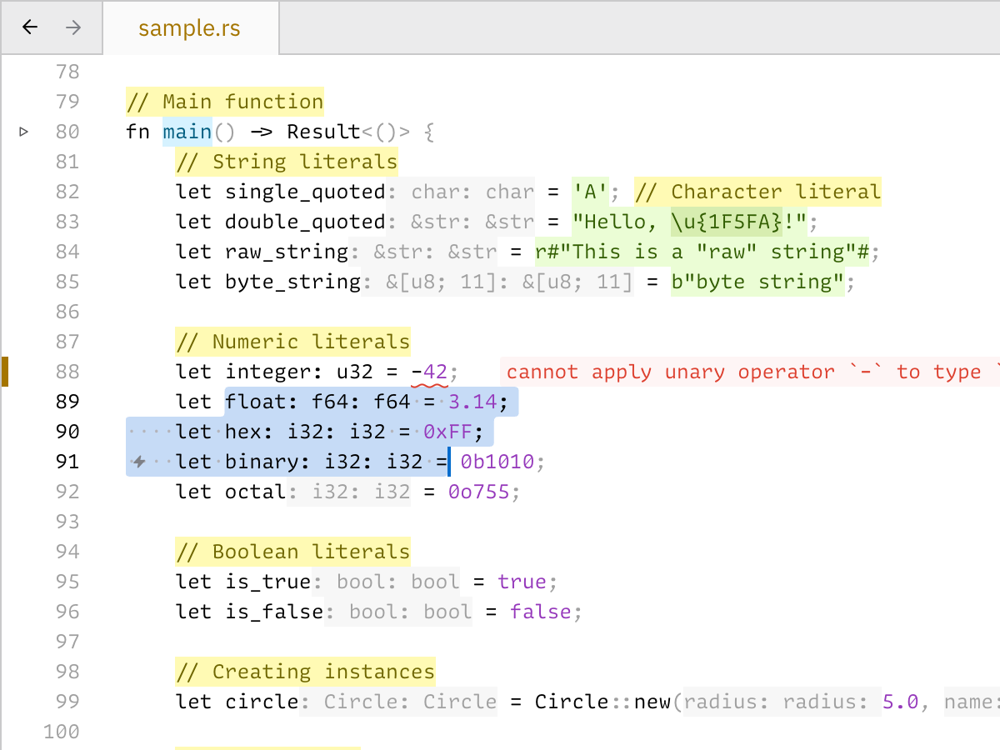
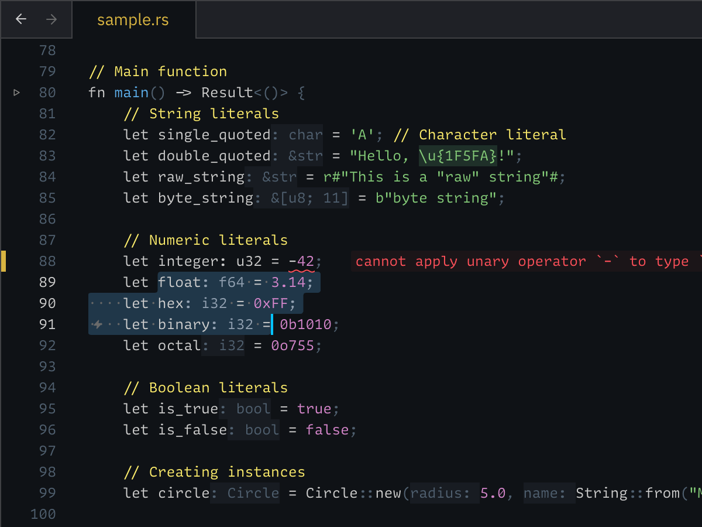

# Alabaster Theme for Zed

A color theme with minimal amount of highlighting for Zed.

- No Christmas lights diarrhea. If everything is highlighted, nothing is highlighted.
- Limit the number of colors to what you can remember.
- Highlight definitions.
- Don’t highlight language keywords.
- Don’t hide comments.

Read full rationale at [tonsky.me/blog/syntax-highlighting](https://tonsky.me/blog/syntax-highlighting/).

Other implementations [here](https://github.com/tonsky/sublime-scheme-alabaster).
